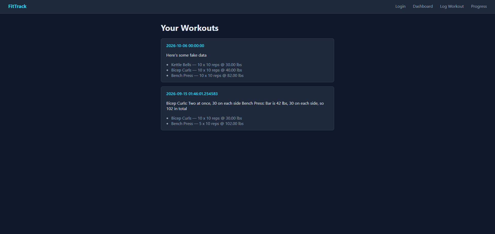

# Fitness Log Application

A full-stack Flask web app for logging strength workouts and reviewing training history.



## Features

- Log workouts with multiple exercises, each with sets, reps, and weight
- JavaScript-driven form for adding exercises and sets dynamically
- Dashboard of past workout sessions
- Relational schema covering users, exercises, workouts, and set entries

## Tech Stack

Python, Flask, SQLAlchemy, SQLite, JavaScript, HTML/CSS

## Getting Started

1. Clone the repo and enter the folder:
```bash
   git clone [your repo URL]
   cd fitness-log-application
```
2. Create and activate a virtual environment:
```bash
   python3 -m venv venv
   source venv/bin/activate
```
3. Install dependencies:
```bash
   pip install -r requirements.txt
```
4. Run the app:
```bash
   [flask run / python app.py]
```
5. Open http://localhost:5000 in your browser.

## Status

In active development. [Planned next: e.g., progress charts, edit/delete workouts.]